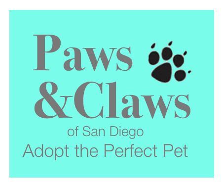

# Project 1
## Team Name: Fantastic 4

  

# Brainstorming:
 
- Open data SD API
- Google maps API
- Ember.js Framework
- Google Basecamp for Project Management
- Google Material Design 
- Materialize CSS Framework

  

# Project Requirements
1. Must use at least two APIs
   * Google Maps API 
   * Google Firebase API
   * ?

2. Must utilize at least one new library or technology that we haven't discussed
   * [Popular Front-end JavaScript Frameworks](https://github.com/showcases/front-end-javascript-frameworks)

3. Must meet good quality coding standards (indentation, scoping, naming)

4. Must NOT use alerts, confirms, or prompts (look into modals!)

5. Must have some sort of repeating element (table, columns, etc)

6. Must use Bootstrap or Alternative CSS Framework

7. Must be Deployed (Github Pages...etc)

8. Must have User Input Validation

  

# Project Ideas:

   

## Fix it App
- SD open data API

 

## Music Based on Emotion App
- Spotify API
- Uses facial recognition to suggest songs or playlists based on mood

 

## Movie Based Emotion App
- IMDB API
- Facial recognition API

 

## Pick me up app that shares your location to someone
- Google maps API

 

## Jeopardy Game
- Plus added features

 

## Digital Missing Pet Bulletin Board
- Google maps API

 

## Add Your Idea Here
- Add it's features and attributes here 

  

# Project Tools:

  

## Project Management Tools:

* [Trello](https://trello.com/)
* [Google Basecamp](https://basecamp.com/)
* [Asana](https://asana.com/)
* [Trello](https://freedcamp.com/)

  

## Project Resources:

* [Google Maps API](https://developers.google.com/maps/)
* [Materialize CSS Framework](http://materializecss.com/)
* [Bootstrap](http://getbootstrap.com/)
* [jQuery](https://jquery.com/)
* [Postman](https://www.getpostman.com/)

