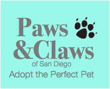

# Group Project #1
## Team Name: Fantastic 4
Team Members: Aruna Vallur, Chryssa Jones, Lorenzo Bartolo, and Gail McFadden.

Using an API's from Petfinder and Google maps, my team and I created a real-time, easy to navigate application to locate dogs and cats available for adoption.

  

# Brainstorming:
 
- Open data SD API
- Google maps API
- Ember.js Framework
- Google Basecamp for Project Management
- Google Material Design 
- Materialize CSS Framework

## Project Resources:

* [Google Maps API](https://developers.google.com/maps/)
* [Materialize CSS Framework](http://materializecss.com/)
* [Bootstrap](http://getbootstrap.com/)
* [jQuery](https://jquery.com/)
* [Postman](https://www.getpostman.com/)

